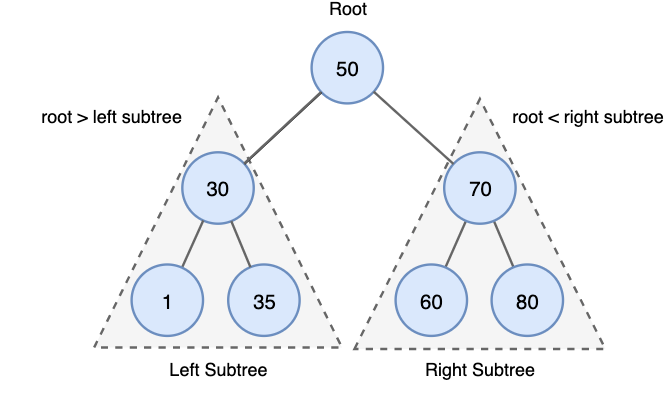
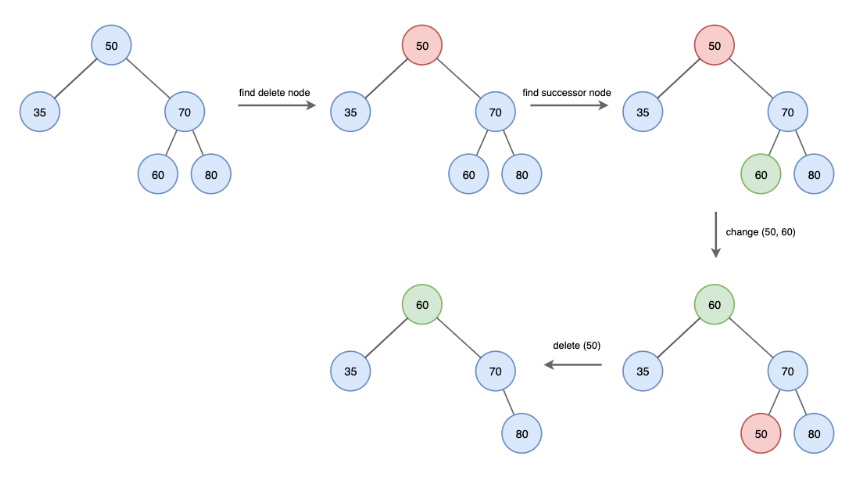

## 🤔 BST(Binary Search Tree, 이진 탐색 트리)이란?

- 트리 구조를 가지면서, **이진 탐색**하기 **쉽게 짜여져 있는 트리**입니다.
- 해당 Node로부터 왼쪽 Subtree의 모든 Node는 해당 Node보다 작은 값이며, 오른쪽 Subtree의 모든 Node는 해당 Node보다 큰 값을 가지고 있습니다.

### 특징

- 모든 Node의 **Children은 최대 2개**입니다. (왼쪽 아니면 오른쪽)

  > 모든 Tree가 균형 상태일 때 (모든 Node의 자손이 2개이거나 없다면) 시간복잡도는 **O(logN)**입니다.

  > 그렇지 않다면, 최대 **O(N)**의 시간이 걸립니다.

- 값을 찾을 때, **Binary Search**를 이용하면 됩니다.

## 🤔 BST의 삭제, 삽입, 탐색 과정

- **탐색(Search)**
  - Root Node에서 시작해 Binary Search 과정을 진행합니다.
- **삽입(Insert)**
  1. Root Node에서 시작해 Binary Search 과정을 진행합니다.
  2. Leaf Node까지 도달 후 Binary Search를 통해 값에 따라 위치를 정한 후 Node를 추가합니다.
- **삭제(Deletion)**

  - 맨 마지막 Leaf Node가 아닌 중간 Node를 지워야 한다면, 지울 Node의 Children을 이용해야 합니다.
  - Leaf Node일 때
    1. 값을 지우고 부모에게 Null 값을 return합니다.
  - Internal Node일 때

    

    1. 가장 **가까운 Successor(자손)**을 찾고, 지우려는 Node에 **그 자손의 값을 복사**합니다.

       > **Successor는 right Subtree의 최솟값**입니다.

    2. 그 **자손의 Data를 삭제**합니다.

## 🛠 관련 문제

- [2957번: 이진 탐색 트리 (acmicpc.net)](https://www.acmicpc.net/problem/2957)
- [5639번: 이진 검색 트리 (acmicpc.net)](https://www.acmicpc.net/problem/5639)
