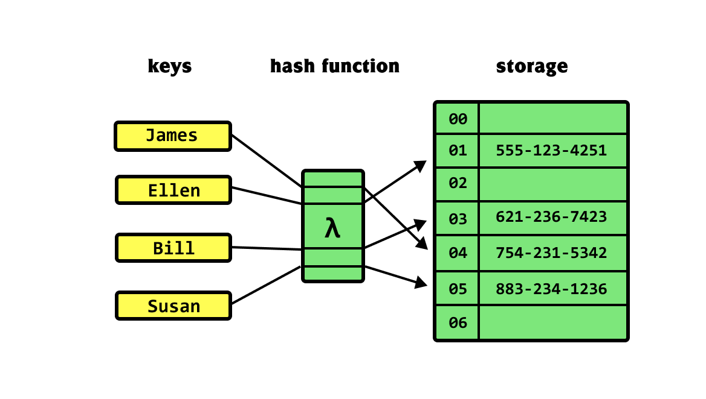
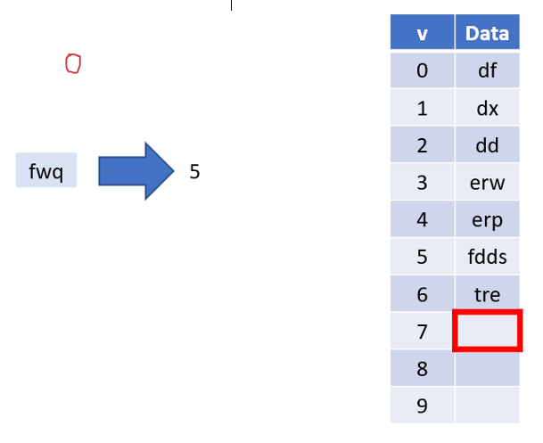
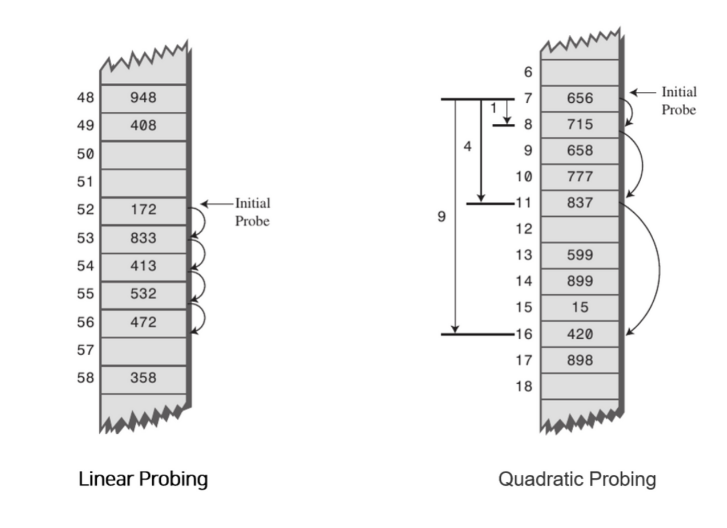
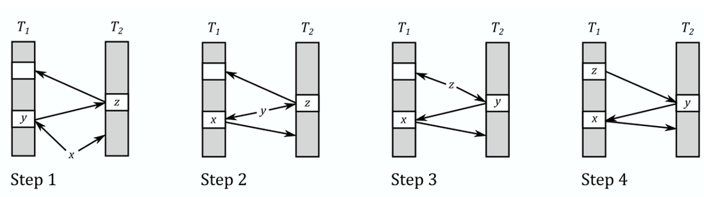

## 🤔 Hash Table(해시 테이블)이란?

- 데이터를 저장하는 **자료구조** 이론 중 **Key**와 **Value**를 쌍을 이뤄 저장하는 방법
- **Key 값**을 **Hash Function**에 입력하여 도출된 **값(Hash Value)**을 **index**로 삼아 Table에 데이터를 저장한다.

> Key 값을 Hash function에 입력하여 데이터를 저장하고 있다.

## 🤔 Hash Table(해시 테이블)을 왜 쓸까요?

- 일반적으로 데이터를 저장할 때 **Array**에 **단순 Index를 사용**하여 저장하곤 하는데 **Hash function**을 사용하여 키를 Mapping하면 **시간복잡도를 좀 더 단축시킬 수 있는 장점**이 있습니다.
  > 보통 복잡한 **Bruth-force 문제**를 풀 때 사용하면 좋습니다
- 탐색, 삽입, 삭제의 과정 모두 **O(1)**의 시간복잡도를 가질 수 있습니다.
  (평균 시간 복잡도 : O(1))

## 🤔 Hash Table(해시 테이블)의 과정은?

1. 해당 Key 값을 **Hash Function**을 통해 **Hash Table**로 전달됩니다.
2. 이 때, 전달되는 값은 Hash Table의 **Index**로 사용됩니다.

> 일반적인 배열로 사용하되, 인덱스를 Hash Function을 통해 사용합니다.

### **Hash Function**의 대표적인 알고리즘

1. **Division Method**
   - 나눗셈을 이용하는 방법으로, 입력값을 테이블의 크기로 나누어 계산하는 방법이다
     > (Index = Input % Table Size)
2. **Multiplication Method**
   - 숫자로 된 Key값 K와 0과 1 사이의 실수 A, 특정 제곱수인 M을 사용하여 다음과 같은 식을 통해 계산하는 방법이다.
     > (h(K) = (K _ A mod 1) _ M)
3. **Universal Hashing**
   - 다수의 해시함수를 만들어 집합 H에 넣어두고, 무작위로 해시함수를 선택하여 해시값을 만드는 방법이다.

## 😥 Hash Table(해시 테이블)의 문제점

- Hash Function은 다른 Key값을 넣었을 때, **동일한 결과값을 도출**할 수 있습니다.
- 이렇게 된다면, **다른 Input에 동일한 Output**을 내놓을 수 있습니다. 😨.

  > 이를 **Hash Collision(해시 충돌)**이라고 일컫습니다.

### 해결 방법

1. **Separate Chaining**
   - **메모리를 추가적으로 사용**하여 동일한 버킷에 값이 있으면, Linked List 혹은 Tree 방식을 사용해 **해당 Value 뒤에 저장하는 방식**을 사용합니다.
     > 데이터 맨 끝에 연결하여 저장하는 법이 핵심입니다.
2. **Open Addressing**

   - Hash Table에서 비어있는 공간이 있다면 이를 활용하는 방법입니다.
   - **대표적인 방법**

   1. **Linear Probing**

      

   - 현재의 Index로부터 **고정폭 만큼씩 이동**하여 차례대로 검색해 비어 있는 공간에 저장하는 방법입니다.
   - 문제점
     - **Load Factor**가 커질 수 있습니다.
       > 들어가야 하는 Hash Value에 항상 값이 차있다면, 계속 밀리고 밀려서 시간이 급격하게 걸릴 수가 있습니다.

   2. **Quadratic Probing**

   

   - 현재의 Index로부터 고정폭이 아닌, **다음 칸의 제곱을 이용**하여 차례대로 검색하여 비어 있는 공간에 저장하는 방식입니다.
   - 문제점
     - 역시 마찬가지로 **Load Factor**가 커질 수 있습니다.

3. **Cuckoo Hashing**

   

- **다수의 Table과 다수의 Hash Function을 사용**해 보는 방법입니다.
- 각 테이블마다 Hash Function이 다르게 적용됩니다.
- 역시 마찬가지로 빈칸을 찾을 때까지 이 과정을 반복합니다.

---

- 이렇게 Hash Coliision를 방지하는 방법들은 **공간을 많이 사용한다**는 단점이 존재합니다.
- 또한, Hash Table은 C++의 Vector나 LinkedList처럼 확장해주는 방식으로 만들게 된다면 효율이 좋지 않습니다.
  - 항상 **테이블을 설계할 때 가급적 확장을 하지 않도록** 해주어야 합니다.
  - 테이블의 공간사용률이 80% 이상이라면, 해시 충돌이 빈번하게 발생하여 성능이 저하된다고 합니다.

## 🛠 관련 문제

- [17219번: 비밀번호 찾기 (acmicpc.net)](https://www.acmicpc.net/problem/17219)
